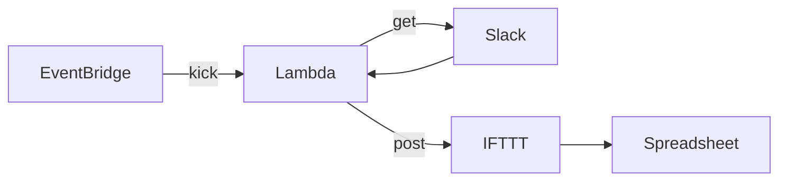

# kakeibo-rs

Slack の特定チャンネルに送信されたメッセージを Spreadsheet に転記するもの

[takaiyuk/kakeibo](https://github.com/takaiyuk/kakeibo) の Rust 版

以下を定期実行する

1. Slack API を利用して Slack メッセージを取得する
2. 特定期間に投稿されたメッセージのみに絞る
3. IFTTT の Webhook URL を利用して Google Sheet に行を追加する



## Execute

```
$ cp .env.example .env
$ make run
```

### Test

```
$ make test
```

## Lambda

[To Be Updated]
