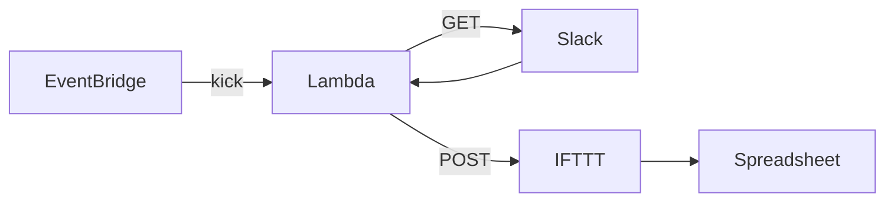

# kakeibo-rs

Slack の特定チャンネルに送信されたメッセージを Spreadsheet に転記するもの

[takaiyuk/kakeibo](https://github.com/takaiyuk/kakeibo) の Rust 版

以下を定期実行する

1. Slack API を利用して Slack メッセージを取得する
2. 特定期間に投稿されたメッセージのみに絞る
3. IFTTT の Webhook URL を利用して Google Sheet に行を追加する



## Execute

```sh
# .env を作成して環境変数を設定する
cp .env.example .env
make run
```

### Lint

```sh
make lint
```

### Test

テストカバレッジを計測するために [cargo-tarpaulin](https://github.com/xd009642/tarpaulin) をインストールする

```sh
cargo install cargo-tarpaulin
make test
```

## Lambda

ref. https://github.com/awslabs/aws-lambda-rust-runtime

### 0. セットアップ

Cargo Lambda をインストールする

```sh
brew tap cargo-lambda/cargo-lambda
brew install cargo-lambda
```

### 1. ビルド

```sh
make build-lambda
```

### 2. デプロイ

```sh
make deploy-lambda
```

### 3. 実行

```sh
make kick-lambda
```
